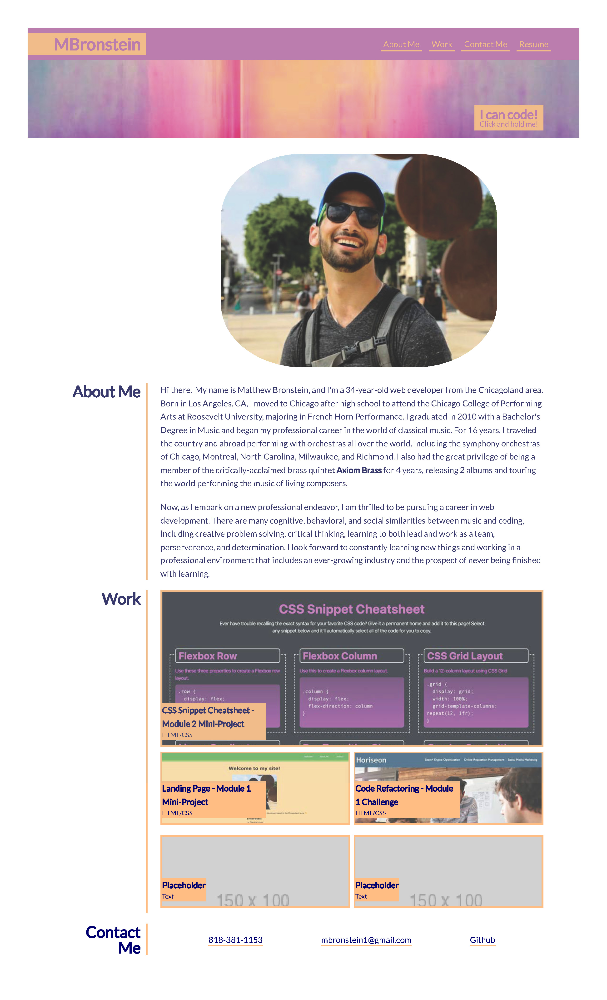

# Portfolio-Challenge2

## Description

This is the second challenge in the Northwestern Coding Bootcamp (Module 2). The assignment was to create a portfolio landing page from scratch based off an image of a generic portfolio template provided by the instructors. All nav links were required to scroll to the corresponding section on the page (minus the "Resume" which is inactive currently), the boxes in the "Work" section needed to take the user to the live page of the corresponding project on-click, and the webpage needed to be responsive to desktop, tablet, and mobile viewports. For fun, I integrated some cool inset box-shadow hover transition effects on links and added a bit of animation (very simple), as well as some opacity hover effects over my project boxes. 

## Link to live page

[Live Link](https://mbronstein1.github.io/Portfolio-Challenge2/)

## Screenshot
